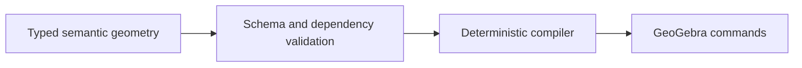

# GeoGebra Copilot

Typed geometry objects, dependency validation and deterministic construction compilation, with a separate Supabase AI runtime.

[Tested semantic library](src/semanticConstruction.ts) · [Compiler](src/geometryCompiler.ts) · [Tests](src/semanticConstruction.test.ts) · [Promotion plan](docs/CANONICAL_BRANCH_PLAN.md)



## What this branch contains

This review branch is based on `test`. Its geometry library makes constructions explicit rather than asking a model to author GeoGebra command strings. The public `main` already has an earlier semantic JSON/compiler pipeline; this branch adds reference checks, construction types and regression tests.

**Runtime boundary:** the diagram describes the tested library. The Supabase AI function currently uses a separate parser/compiler in [copilot.ts](supabase/functions/_shared/copilot.ts), whose envelope checks do not call this strict validator. Integrating the library at that boundary is required before claiming the full chain validates live AI requests.

## Technical highlights

- A discriminated union and strict Zod schemas describe points, lines, triangle centers, circles, intersections and reflections.
- Dependency validation rejects duplicate names, undefined references and invalid line/circle references.
- The compiler reuses auxiliary lines and bisectors while emitting dependency-ordered commands.
- Regression cases cover altitude feet, orthocenters, circumcenters, incenters, line-circle intersections, reflections and command normalization.

## Concrete output

With `A` and `B` already defined, `{ "type": "midpoint", "name": "M", "of": ["A", "B"] }` compiles to `M = Midpoint(A, B)`. An orthocenter is expressed as the intersection of constructed altitudes.

See the [public main-branch fixture](https://github.com/s4m256/Geogebra-Copilot/blob/main/docs/CONSTRUCTION.md) for a fixed-input applet demonstration. It proves compiler output can be executed, not that a live provider or this branch's backend has been verified.

## Verification

```bash
npm ci
npm run verify
```

The audit on 2026-09-19 passed **9 tests, TypeScript/Vite build and ESLint**. These are library tests, not end-to-end provider, authentication, billing or geometric-correctness guarantees.

## Development

Run `npm run dev`. Configure the public `VITE_SUPABASE_URL`, `VITE_SUPABASE_ANON_KEY` and `VITE_SUPABASE_FUNCTIONS_URL` values. Provider secrets belong in backend configuration; see [Supabase setup](supabase/README.md) and [release checklist](RELEASE_CHECKLIST.md).

The [hosted preview](https://geogebra-copilot.vercel.app) loaded its canvas but returned a missing-key error during the audit. Its deployment revision was not established; it is not presented as a verified semantic demo.

Schema/reference validation is not a theorem prover or complete degeneracy check. Production auth, solve-mode quality and billing readiness remain unverified.
