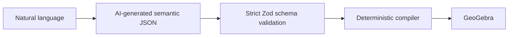
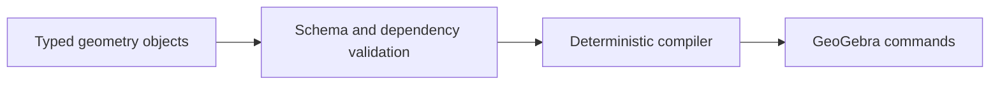

# GeoGebra Copilot

Natural-language geometry compiled from typed semantic objects into deterministic GeoGebra commands.

[Interactive compiler demo](https://s4m256.github.io/Geogebra-Copilot/) · [Compiler](src/geometryCompiler.ts) · [Extended implementation and tests](https://github.com/s4m256/Geogebra-Copilot/tree/test) · [Branch review plan](docs/CANONICAL_BRANCH_PLAN.md)




*Fixed semantic input executed in the actual GeoGebra applet; no AI request. [Input, emitted commands and reproduction](docs/CONSTRUCTION.md).*

## Why

An altitude, orthocenter or reflection has meaning beyond command syntax. The model returns typed construction objects; TypeScript code owns the command strings. This architecture is already present on `main`, although the previous README incorrectly described raw command generation.

## Technical highlights

- [Strict Zod schemas](src/ai.ts) check supported object shapes before compilation. An invalid response gets one repair request with validation feedback.
- The [compiler](src/geometryCompiler.ts) expands objects into ordered GeoGebra commands and reuses auxiliary lines and altitude constructions.
- The model prompt asks for semantic JSON; [the bridge](src/geogebra.ts) manages execution in the embedded applet.
- Supported objects on `main` include points, triangles/quadrilaterals, segments, lines, midpoints, altitude feet, orthocenters, diameter-defined circles, intersections and reflections.

## Concrete output

With points `A` and `B` already defined:

```json
{ "type": "midpoint", "name": "M", "of": ["A", "B"] }
```

compiles to `M = Midpoint(A, B)`. An orthocenter is compiled as the intersection of constructed altitude lines rather than delegated to the model as raw command syntax.

## Extended validation on `test`

The [semantic library](https://github.com/s4m256/Geogebra-Copilot/blob/test/src/semanticConstruction.ts) adds duplicate-name and dependency checks, and additional constructions such as circumcenters, incenters, parallel lines and angle bisectors:



**Integration boundary:** this stronger library is tested, but `test`'s Supabase runtime uses a separate parser/compiler in `supabase/functions/_shared/copilot.ts`. That parser checks the response envelope rather than calling the strict library. Do not infer that the complete validation chain currently guards live backend requests. See the [review plan](docs/CANONICAL_BRANCH_PLAN.md).

## Verification

For this default branch (Node 24+ for the bridge regression tests):

```bash
npm ci
npm test
npm run build
npm run lint
```

For the extended library:

```bash
git clone --branch test https://github.com/s4m256/Geogebra-Copilot.git geogebra-semantic
cd geogebra-semantic
npm ci
npm run verify
```

The `test` branch passed **9 tests, TypeScript/Vite build and ESLint** on 2026-09-19. Tests exercise schema/reference rejection, compiler output and command normalization. They are not live-provider or geometric-correctness guarantees.

## Public demo and development

The [public demo](https://s4m256.github.io/Geogebra-Copilot/) compiles a fixed triangle/altitude/orthocenter construction. Click **Explore triangle and orthocenter**, then drag the vertices in GeoGebra. It uses the real compiler, preserves the native toolbar, and needs no account or API key. It does **not** call an AI model.

Natural-language generation requires a locally configured provider. Keep any `VITE_GROQ_API_KEY` local: Vite embeds these values in client bundles, so never deploy a build containing a private key. The public GitHub Pages build supplies none.

```bash
npm ci
npm run dev
```

The public applet requires access to GeoGebra's servers. The stronger `test` architecture remains separate pending the integration described above.

The compiler is not a theorem prover: schema validation does not establish nondegeneracy or mathematical correctness.
