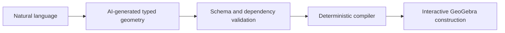

# GeoGebra Copilot

Natural-language geometry validated as typed objects and compiled into interactive GeoGebra constructions.

[Interactive demo](https://s4m256.github.io/Geogebra-Copilot/) · [Semantic validator](src/semanticConstruction.ts) · [Compiler](src/geometryCompiler.ts)




*The public demo uses fixed semantic input and the real compiler, with no model call. Click **Explore triangle and orthocenter**, then drag a vertex: the altitude and orthocenter update with it. No account or key required.*

## Why

A midpoint, altitude or orthocenter describes a geometric relationship. The model proposes those objects; validation checks their structure and references, and TypeScript owns the command generation. GeoGebra maintains the relationships as the construction changes.

## Technical highlights

- **Validation at the response boundary:** strict Zod schemas reject unsupported fields; dependency checks reject duplicate names, forward references and incompatible point/line/circle references. The model gets one repair request with validation feedback.
- **Deterministic compilation:** generated helper names avoid explicit object names, and named lines remain addressable even when they share endpoints. Direct compiler calls also pass validation.
- **Dynamic geometry:** the bridge executes dependency-based intersections before attempting numeric fallbacks. Regression tests cover a bug where an inferred auxiliary-line name incorrectly placed an altitude foot.
- **Inspectable output:** the public example displays the emitted commands and preserves GeoGebra's native tools. [Semantic input and output](docs/CONSTRUCTION.md) can also be reproduced locally.

Supported constructions include points, triangles/quadrilaterals, segments, lines, midpoints, altitude feet, orthocenters, diameter-defined circles, intersections and reflections. For example, `{ "type": "midpoint", "name": "M", "of": ["A", "B"] }` compiles to `M = Midpoint(A, B)` after validating that A and B are points defined earlier.

## Verification

With Node.js 24 or newer:

```bash
npm ci
npm test
npm run build
npm run lint
node scripts/construction-proof.mjs
```

The test suite covers valid constructions, malformed model responses, dependency/type errors, helper-name collisions and bridge execution. GitHub Pages repeats tests, build and lint on deployment. Browser checks additionally verified the example and vertex dragging.

## Development and limitations

```bash
npm run dev
```

Natural-language generation requires a locally configured provider. Keep `VITE_GROQ_API_KEY` local: Vite embeds these values in client bundles. Never deploy a private provider key; the public Pages build supplies none. The applet requires access to GeoGebra's servers.

The compiler is not a theorem prover. Structural validation does not prove nondegeneracy or mathematical correctness; numeric fallbacks, when needed, cannot preserve all symbolic dependencies.

The separate [`test` branch](https://github.com/s4m256/Geogebra-Copilot/tree/test) includes additional object types and Supabase integration. Its validation approach was adapted for `main`'s supported language; its authentication, billing and separate backend parser were not merged. See the [branch review plan](docs/CANONICAL_BRANCH_PLAN.md).
